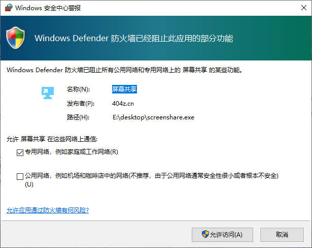
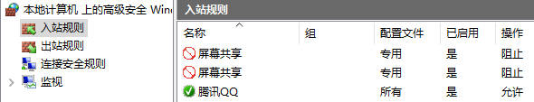
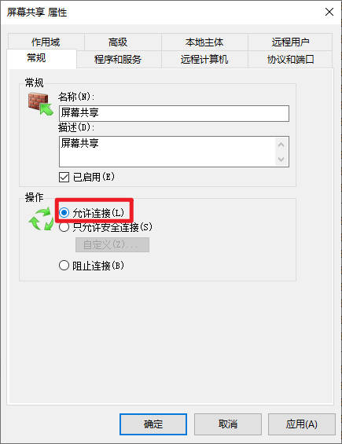

# 问题排查

## 0x00 网站无法访问

### 共享地址IP为`127.0.0.1`

#### 原因

内网IP，仅限本机使用

#### 解决方法

1. 更换其他IP地址

### 防火墙

#### 原因

用户没有允许该软件进行网络访问，如图所示

#### 解决方法

1. 使用快捷键组合`Win+R`，打开`运行`
2. 输入`wf.msc`点击`确定`，打开`防火墙`
3. 点击左侧`入站规则`，找到名称为`屏幕共享`
4. 查看是否被`阻止`，如图所示
   
5. 依次双击规则，选择`运行连接`，如图所示
   
