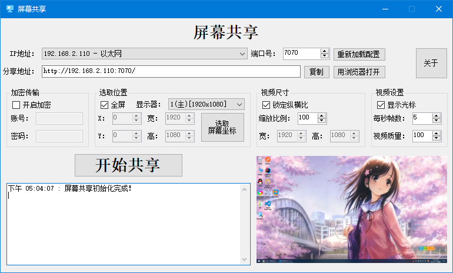
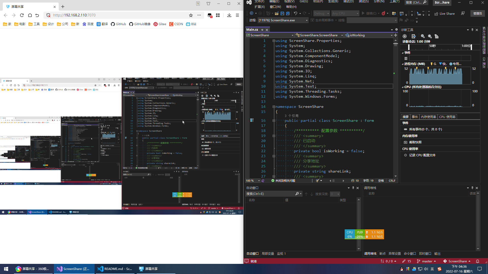

# Local Network Screen Share 局域网屏幕共享

## 主要功能

- [x] 密码验证
- [x] 支持多显示器
- [x] 支持高DPI
- [x] 自定义选择区域
- [x] 视频尺寸调节
- [x] 视频质量调节
- [x] 视频帧数调节
- [x] 光标显示
- [x] 视频预览
- [x] 托盘运行
- [x] 查看访问用户详细信息
- [ ] 配置信息保存、导入与导出
- [ ] 黑白名单
- [ ] 开机自启与自动运行
- [ ] 整合`FFmpeg`

## 软件截图

## 运行示例

## 参考

- [EslaMx7/ScreenTask](https://github.com/EslaMx7/ScreenTask)
- [xChivalrouSx/CaptureScreen](https://github.com/xChivalrouSx/CaptureScreen)
- [MrKonstantinSh/OpenScreen](https://github.com/MrKonstantinSh/OpenScreen)

## 交流

- [x] QQ：`1416978277`
- [x] 微信：`1416978277`
- [x] 支付宝：`1416978277@qq.com`

## 赞助

