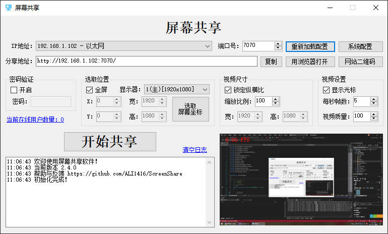
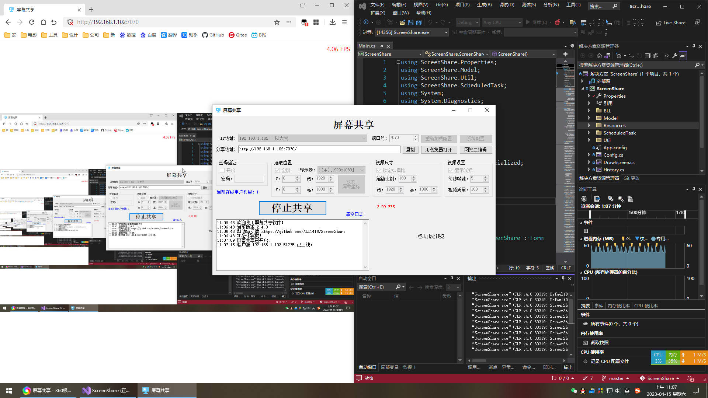

# Local Network Screen Share 局域网屏幕共享

## 主要功能

- [x] 密码验证
- [x] 支持多显示器
- [x] 支持高DPI
- [x] 自定义选择区域
- [x] 视频尺寸调节
- [x] 视频质量调节
- [x] 视频帧数调节
- [x] 光标显示
- [x] 视频预览
- [x] 托盘运行
- [x] 查看访问用户详细信息
- [x] 网站二维码
- [ ] 配置信息保存、导入与导出
- [ ] 开机自启与自动运行
- [ ] 黑白名单

## 运行示例

## 更新日志

[点击查看](./CHANGELOG.md)

## 问题排查

[点击查看](./HELP.md)

## 参考

- [EslaMx7/ScreenTask](https://github.com/EslaMx7/ScreenTask)
- [xChivalrouSx/CaptureScreen](https://github.com/xChivalrouSx/CaptureScreen)
- [MrKonstantinSh/OpenScreen](https://github.com/MrKonstantinSh/OpenScreen)

## 关于

<object data="https://404z.cn/images/about.svg" style="max-width:100%;">
  <picture>
    <source media="(prefers-color-scheme: dark)" srcset="https://404z.cn/images/about.dark.svg">
    
  </picture>
</object>
