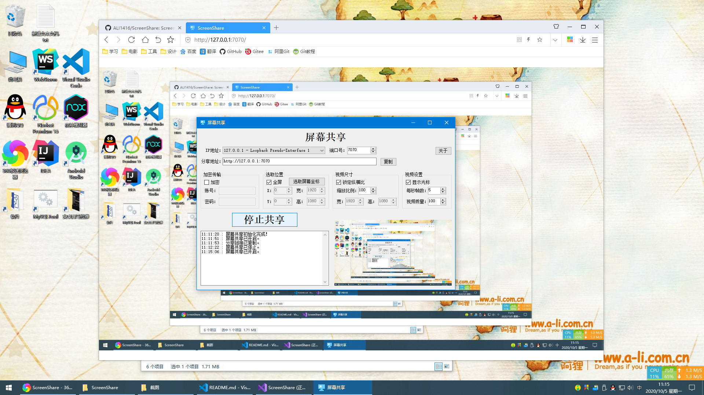

# ScreenShare

局域网屏幕共享

支持加密传输，对方输入账号密码才能访问

支持自定义区域

支持自定义视频尺寸

支持光标显示

支持帧数和视频质量设置

示例：

## 项目链接
[Github](https://github.com/ALI1416/ScreenShare)

[Gitee](https://gitee.com/ALI1416/ScreenShare)

## 许可证

## 交流
QQ：1416978277  
微信：1416978277  
支付宝：1416978277@qq.com  

## 赞助

